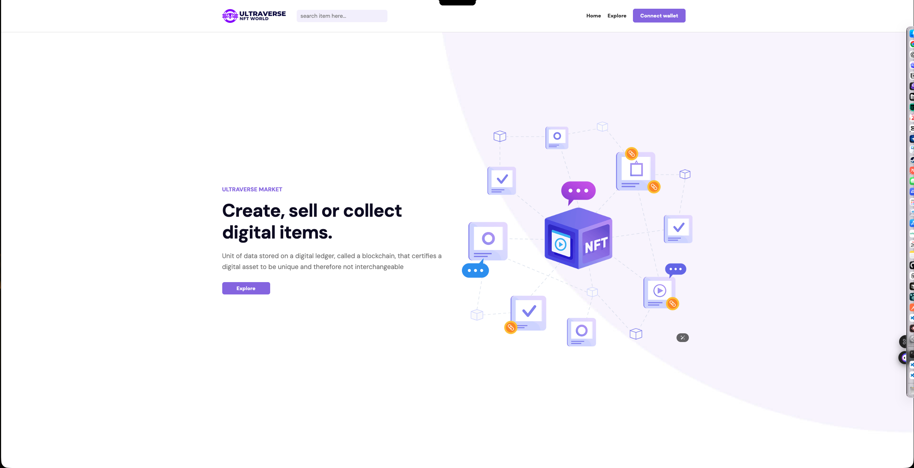
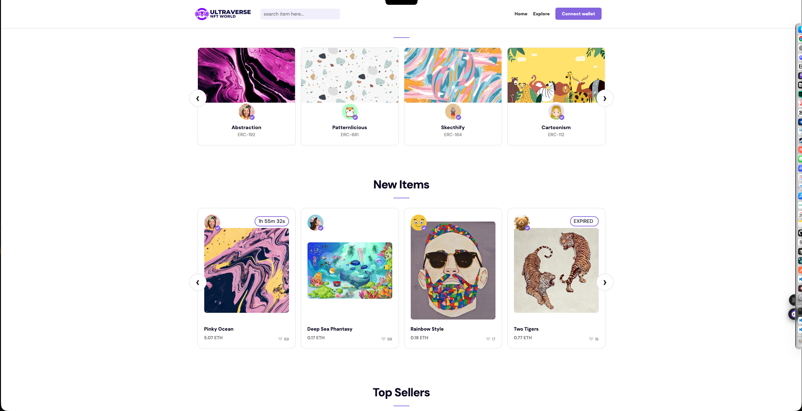

Ultraverse NFT Marketplace

Ultraverse is a multi-page React marketplace application built around dynamic routing, API-driven content, reusable UI systems, and connected user flows.

The project simulates a real marketplace experience where collections, creators, marketplace items, and profile pages all interact through shared data and navigation patterns. Rather than treating each screen as an isolated page, the application was built as a connected product where users can move naturally between listings, item details, creator profiles, collections, and marketplace discovery features.

The primary focus of this project was frontend engineering. I spent most of my time building route-driven experiences, asynchronous data handling, reusable loading systems, interactive state management, and connected page architecture.

Live Demo

[live Demo - internship-flax-five.vercel.app](https://internship-flax-five.vercel.app/)

Project Preview

These previews highlight the marketplace interface, the API-driven listing experience, and the kind of motion and browsing flow users see across the app.

⸻

Key Features

Marketplace Experience

- Multi-page React application using React Router
- Dynamic item detail pages
- Dynamic author profile pages
- Connected collection and creator experiences
- Explore page with sorting and progressive loading
- Marketplace item countdown functionality

Data & State Management

- API-driven content from multiple cloud function endpoints
- Dynamic route parameter handling
- Interactive follow and unfollow behavior
- Real-time countdown formatting
- Client-side sorting and filtering
- Loading, error, and empty-state handling

User Experience

- Reusable skeleton loading system
- Carousel-driven collection showcases
- Responsive layouts
- Scroll-triggered animations using AOS
- Consistent navigation between related marketplace content

⸻

Tech Stack

Frontend

- React 17
- React Router DOM
- JavaScript
- Create React App

Data & Libraries

- Axios
- React Slick
- AOS

Deployment

- Vercel

⸻

Architecture Highlights

Dynamic Routing

The marketplace is built around route-driven navigation.

Item detail pages and creator profile pages are generated dynamically using route parameters, allowing marketplace content to scale without requiring manually created pages.

Connected Content Architecture

Marketplace cards, item detail pages, creator profiles, and collection views are intentionally linked together through shared data relationships.

This creates a navigation flow where users can move naturally through the platform instead of interacting with disconnected screens.

Reusable Loading Infrastructure

Loading behavior is handled through a shared skeleton component system used across:

- Marketplace cards
- Creator profiles
- Collection sections
- Detail pages
- Text content
- Avatar components

This keeps layouts stable during asynchronous requests and improves perceived performance.

API-Driven Application Structure

The application consumes data from multiple endpoints that power different areas of the marketplace.

Each section manages its own loading lifecycle, response handling, and fallback states while maintaining a consistent user experience throughout the application.

⸻

Engineering Challenges

The most challenging part of the project was coordinating multiple API-driven views while keeping the experience cohesive.

Different marketplace sections rely on separate cloud function endpoints, each with its own response structure, loading behavior, and failure cases. Building a consistent experience required reusable loading states, defensive error handling, and data transformation before rendering content to the UI.

The routing layer also required careful planning. Item pages, creator pages, and collection views all depend on route parameters and related marketplace data. I had to ensure those relationships remained connected while still handling invalid routes, missing data, and loading transitions gracefully.

Another important challenge was maintaining interface stability during asynchronous operations. Instead of allowing sections to flash empty content while requests completed, I built reusable skeleton components that preserve layout structure and improve perceived responsiveness.

The explore page introduced additional complexity through client-side sorting, progressive loading, countdown logic, and state-driven UI updates that all needed to work together without disrupting the browsing experience.

⸻

What This Project Demonstrates

This project demonstrates several frontend engineering concepts that appear frequently in production applications:

- Dynamic routing
- API integration
- Asynchronous data handling
- State-driven UI updates
- Reusable component architecture
- Loading and error-state management
- Connected multi-page application design
- User experience optimization

While the marketplace theme provides the context, the underlying value of the project is the application architecture and the engineering decisions required to support it.

⸻

Local Setup

Install dependencies

npm install

Run the application

npm start

Open

http://localhost:3000

Create a production build

npm run build

Run tests

npm test

⸻

Future Improvements

If I continued development, I would focus on:

- API abstraction and service layers
- Client-side caching strategies
- Improved component-level testing
- Advanced filtering and search capabilities
- Persistent follow relationships
- Expanded marketplace interactions
- Performance optimization for larger datasets

⸻

Author

Justin H.

[GitHub.com/massiahtheruler](https://github.com/massiahtheruler)

[LinkedIn.com/in/justin-frontend](https://linkedin.com/in/justin-frontend)
